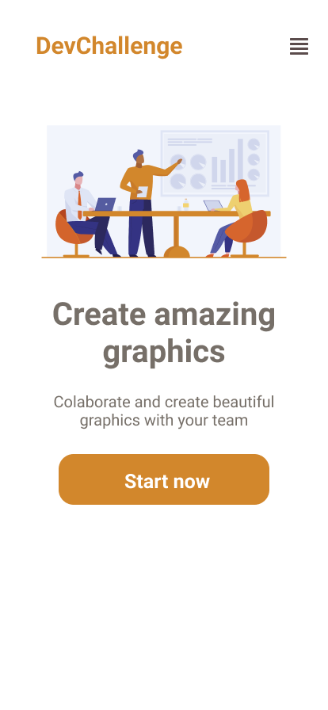

<h1>Amazing Graph</h1>

Portuguese Version

 Este projeto foi elaborado partindo de um desafio proposto no site <a href="https://devchallenge.vercel.app/">DevChallenge</a> e se trata de uma landing page para um site de criação de gráficos.

Além do que foi proposto pelo site, aproveitei para colocar em prática a função de esconder o menu de navegação quando o site está em uma resolução para celular, assim o menu será apresentado ao clicar no sanduiche no cabeçalho. 

<h1>Amazing Graph</h1>

English Version

 This project was created based on a challenge proposed on the website <a href="https://devchallenge.vercel.app/">DevChallenge</a> and it is a landing page for a graphics creation website .

In addition to what was proposed by the site, I took the opportunity to put into practice the function of hiding the navigation menu when the site is in a mobile resolution, so the menu will be presented when clicking on the sandwich in the header.

:) 